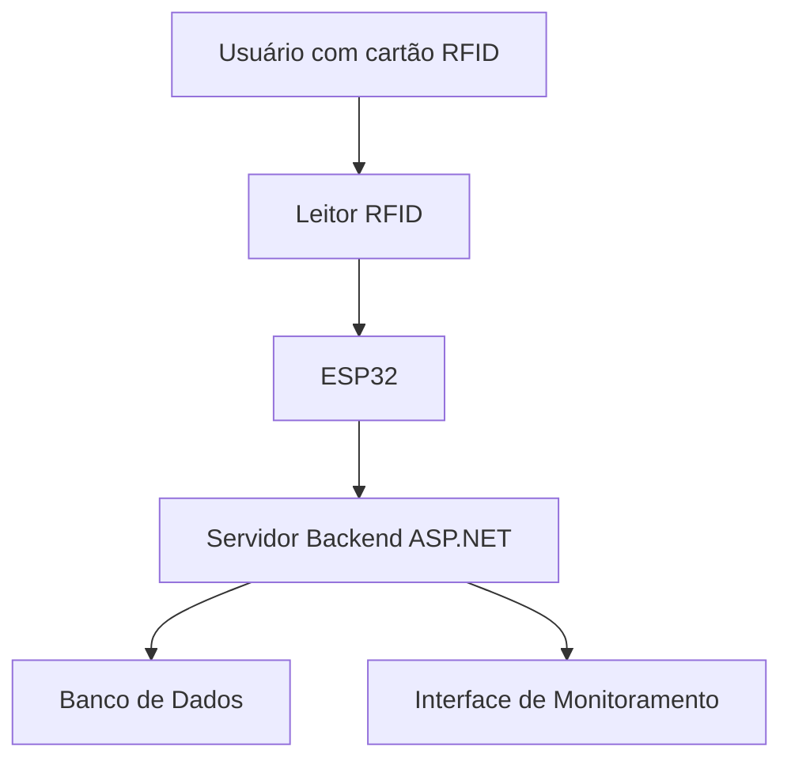

# **Tag System**

## Overview:

## Descrição:

Este projeto consiste no desenvolvimento de um sistema de controle de acesso baseado em um hardware embarcado com **ESP32** e um **leitor RFID**. O sistema será integrado a uma **aplicação Web** para monitoramento e gerenciamento em tempo real.

A solução é composta por duas partes principais:
1. **Aplicação IoT**: desenvolvida em **C++** e rodando no ESP32, será responsável pela lógica de controle de acesso.
2. **Aplicação Web**: desenvolvida com **ASP.NET** no backend e **Next.js** no frontend, permitirá monitoramento e gerenciamento do sistema.

### Funcionalidades

- **Leitura de RFID**: Identificação de usuários através de cartões RFID.
- **Autenticação**: Controle de acesso baseado em cartões cadastrados.
- **Monitoramento em tempo real**: Registro e visualização de eventos de acesso através da aplicação web.
- **Integração com IoT**: Comunicação entre o hardware ESP32 e o servidor web para troca de informações e registros.

----

## Documentação:

1. [Padrões de Commits](docs/commit-patterns.md)  
2. [Gerenciamento de Branches](/docs/branch-management.md)
3. [Ferramentas e Dependências](/docs/tools-and-dependencies.md)
4. [PRD](/docs/prd/prd.md)  
    1. [Problemas](/docs/prd/problems.md)  
    2. [Brainstorm](/docs/prd/brainstorm.md)  
5. [Diagrama Entidade Relacionamento (Figma)](https://www.figma.com/design/3oB1nT9B4BTFo6LasEkG53/TAG-System---DER?node-id=86-813&t=wrFsvmaySl8aBn76-1)
<!-- 6. Preparar o ambiente para rodar a aplicação:  
    1. [Ubuntu WSL Terminal (Recomendado)](/docs/application-environment/ubuntu.md)
    2. [Windows Terminal](/docs/application-environment/windows.md) -->