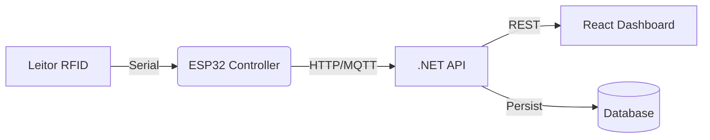

# 🔐 IoT Access Control System — Design Patterns


## 🎯 Objetivo

Sistema de **monitoramento e controle de acesso** utilizando **ESP32** e **RFID**, desenvolvido com arquitetura **.NET (Back-End)** e **React (Front-End)** como projeto interdisciplinar da disciplina de IoT.

O sistema permite o **registro e autenticação por cartões RFID**, com rastreamento em tempo real dos acessos via dashboard web.

---

## 🏗️ Arquitetura


```mermaid
graph LR
    A[Leitor RFID] -->|Serial| B(ESP32 Controller)
    B -->|HTTP/MQTT| C[.NET API]
    C -->|REST| D[React Dashboard]
    C -->|Persist| E[(Database)]
```

---

## 🛠️ Stack Tecnológico

| Camada | Tecnologia | Função |
|--------|-----------|--------|
| **Hardware** | ESP32 + RFID RC522 | Leitura de cartões e comunicação |
| **Back-End** | .NET / C# | API REST para gerenciamento de acessos |
| **Front-End** | React | Dashboard de monitoramento em tempo real |
| **Padrões** | Design Patterns (MVC, Observer) | Arquitetura limpa e escalável |

---

## 💡 Conceitos Aplicados

- **Design Patterns**: MVC, Observer, Singleton
- **IoT**: Comunicação serial entre hardware e software
- **API RESTful**: Endpoints para CRUD de acessos e usuários
- **Real-time**: Monitoramento de eventos de acesso em tempo real

---

## 📂 Estrutura do Projeto

```
├── ESP32/              # Firmware do microcontrolador
├── API/                # Back-End .NET
├── Frontend/           # Dashboard React
└── README.md
```

---

## 👨‍💻 Autor

**Ricardo Silva** — Desenvolvedor Full Stack | Automação & IoT

[](https://www.linkedin.com/in/ricardo-ferreira-silva-/)
[](https://github.com/ricardofsilva7)
