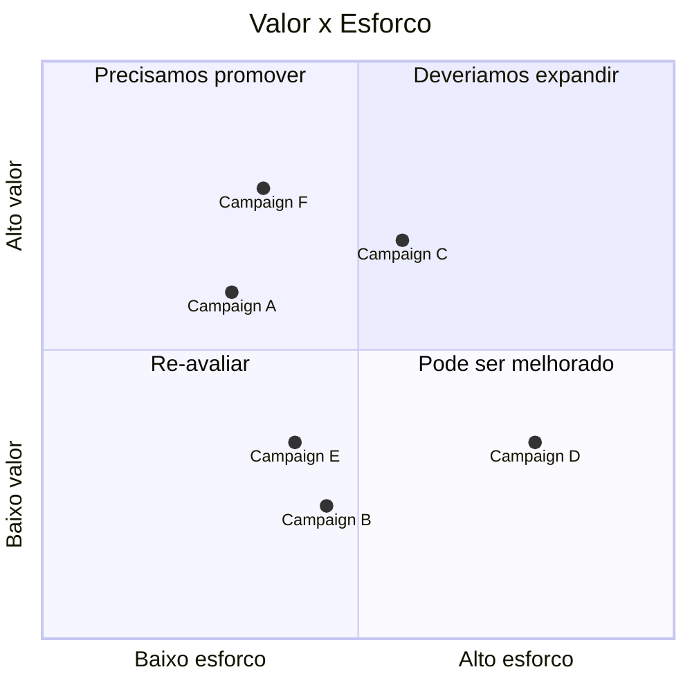

## Brainstorm de soluções:

[Material de Referência](https://cainaantunes.notion.site/Engenharia-de-Software-7e6ce48beeb348909e40460158c29e91)

## 1. Automatização da Coleta de Dados:
**Objetivo:** Reduzir erros e aumentar a precisão

- **Tratamento dos dados que originam-se dos sensores em campo**: Implementação de tecnologias para processar e limpar os dados dos sensores, minimizando erros e melhorando a qualidade dos dados.
  
- **Usar estrutura de nuvem para armazenar dados**: Utilização de plataformas de nuvem para garantir armazenamento seguro, escalável e acessível dos dados coletados em tempo real.

## 2. Monitoramento em Tempo Real:
**Objetivo:** Visibilidade instantânea do processo produtivo

- **[A] Persistência dos dados para sempre ter os dados mais atualizados**: Implementação de sistemas que garantam a persistência dos dados, assegurando que sempre estejam atualizados e disponíveis para consulta em tempo real.
  
- **[B] Criação de alertas**: Desenvolvimento de alertas automatizados para notificar os usuários sobre eventos ou condições específicas que exijam atenção imediata, como falhas nos sensores ou parâmetros fora do padrão.

## 3. Análise Avançada:
**Objetivo:** Geração de relatórios detalhados e identificação de tendências

- **[C] Oferecer métricas personalizadas**: Criação de métricas adaptadas às necessidades do negócio, permitindo uma análise mais precisa e relevante dos dados coletados.
  
- **[D] Usar métodos de predição para potencializar as tomadas de decisões**: Implementação de algoritmos de previsão, como aprendizado de máquina, para prever tendências e apoiar decisões estratégicas baseadas em dados históricos.

## 4. Otimização de Processos:
**Objetivo:** Melhoria da eficiência e redução de custos ao eliminar desperdícios

- **[E] Novos métodos de trabalho baseados em dados concretos**: Desenvolvimento de novos processos de trabalho e operações com base nos dados coletados, visando maior eficiência e eliminação de falhas.
  
- **[F] Agilizar compras e reabastecimentos baseados em análises**: Implementação de sistemas que analisem os dados em tempo real para otimizar o gerenciamento de estoques, compras e reabastecimento, reduzindo custos operacionais.

---

## Gráfico de Valor vs. Esforço

---

### [**> Retornar à Página Inicial.**](/README.md)