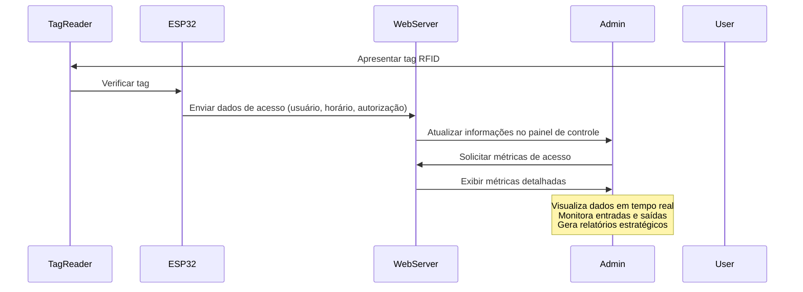
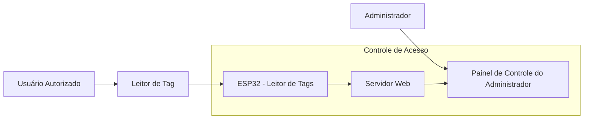
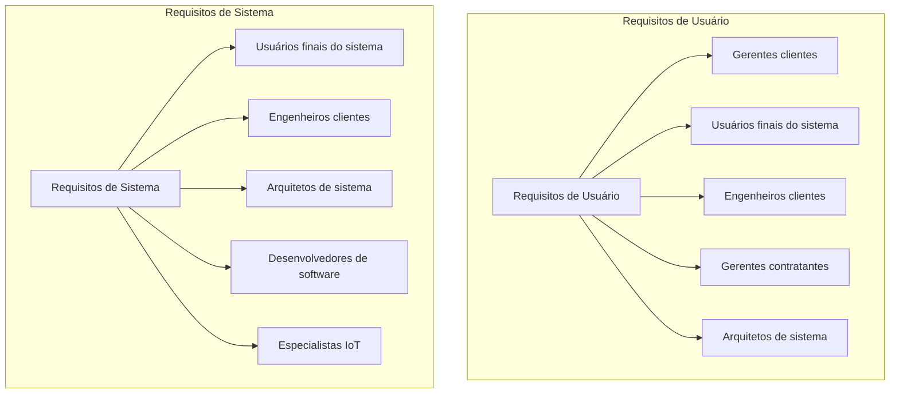

# PRD - Product Requirements Document

### Tag System.

# *Introdução & objetivo*
O objetivo do Tag System é monitorar o acesso de usuários a uma sala restrita através de tags RFID. A solução incluirá um dispositivo ESP32 instalado na porta da sala, que se comunicará com uma página web onde o administrador pode gerenciar os usuários e suas respectivas tags. As métricas coletadas e exibidas em tempo real incluem dados sobre quem entrou na sala, horários de entrada, e a autorização de entrada, além de outros dados para análise de comportamento de acesso.

O sistema visa aumentar a segurança da sala, garantir que apenas usuários autorizados possam acessar o ambiente e oferecer informações valiosas sobre os padrões de acesso e movimentação na sala. Ele será fundamental para controlar o acesso físico de maneira automatizada e eficiente.

[Ref.: Identificar problema](problems.md)

# *Por que* implementar isto?

Implementar essa solução é essencial para garantir o controle de acesso seguro e eficiente a áreas restritas. Ao automatizar o processo de verificação das tags e monitorar em tempo real o status de acesso, o sistema evita erros humanos e melhora a rastreabilidade e a segurança. Além disso, a possibilidade de gerar métricas sobre os acessos permite ao administrador tomar decisões informadas sobre segurança e uso da sala.

[Ref.: Brainstorm](brainstorm.md) 

---

# ***Público alvo***
| Perfil de usuário        | Descrição, necessidades e interesses |
| ------------------------ | ------------------------------------ |
| Administrador de Sistema | Necessita de uma interface para gerenciar usuários e suas tags, bem como visualizar as métricas de acesso. |
| Usuário Autorizado       | Utiliza a tag para acessar a sala, sendo monitorado e registrado no sistema. |
| Analista de Segurança    | Precisa de dados sobre a frequência de acessos, tentativas de acesso não autorizadas e horários de maior movimentação. |

# *Personas*
1. 🧑‍💻 **Carlos (Administrador)**: Carlos é o responsável por gerenciar os usuários e as tags associadas. Ele precisa de uma interface simples e eficaz para adicionar e remover tags, além de monitorar os dados em tempo real para garantir a segurança da sala.
2. 👷‍♂️ **Ana (Usuária Autorizada)**: Ana tem acesso à sala e utiliza sua tag RFID para entrar. Ela precisa de uma experiência de entrada sem complicações e precisa confiar que seu acesso será registrado de forma segura e eficiente.
3. 👩‍💼 **Beatriz (Analista de Segurança)**: Beatriz analisa os dados de acesso, buscando padrões e possíveis brechas de segurança. Ela precisa de relatórios detalhados sobre os acessos, como horário de maior movimentação e tentativas de acesso não autorizadas.

# *Diagrama de sequência da aplicação*
- Este diagrama apresenta uma visão geral do ecosistema da aplicação:

- Este diagrama apresenta o contexto da aplicação:

#  *Requisitos Funcionais*

### Monitoramento de Acesso em Tempo Real 
*Descrição*: O sistema deve monitorar em tempo real o acesso dos usuários à sala, registrando a tag apresentada, o horário de entrada e se o acesso foi autorizado. Critérios de Aceitação: O sistema deve ser capaz de registrar e exibir essas informações no painel de controle em tempo real, atualizando as métricas a cada entrada. Prioridade: P1 - <u>Crítico</u>

### Gerenciamento de Usuários e Tags 
*Descrição*: O administrador deve poder cadastrar usuários, atribuir tags a eles, e modificar as permissões de acesso diretamente pela página web. Critérios de Aceitação: O administrador deve ser capaz de cadastrar novos usuários, associar e desassociar tags, e alterar permissões de acesso sem erros. Prioridade: P1 - <u>Crítico</u>

### Exibição de Métricas de Acesso  
*Descrição*: O sistema deve exibir métricas sobre quem entrou na sala, horários de entrada, tentativas de acesso não autorizadas e horários de maior movimentação. Critérios de Aceitação: As métricas devem ser visualizadas em tempo real e também em relatórios, com gráficos claros e atualizados a cada entrada de dados. Prioridade: P2 - <u>Importante</u>

### Notificações em Tempo Real para Acessos Não Autorizados   
*Descrição*: O sistema deve enviar notificações para o administrador sempre que uma tentativa de acesso não autorizado for registrada. Critérios de Aceitação: O administrador deve ser notificado por e-mail ou SMS em tempo real quando uma tag não autorizada tentar acessar a sala. Prioridade: P2 - <u>Importante</u>

### Geração de Relatórios de Acesso  
*Descrição*: O sistema deve permitir a geração de relatórios detalhados sobre acessos, incluindo dados como horários, usuários, e status de autorização. Critérios de Aceitação: O sistema deve permitir a criação de relatórios personalizados, com filtros por data, usuário, ou status de acesso. Os relatórios devem ser exportáveis em formatos PDF ou CSV. Prioridade: P2 - <u>Importante</u>

*P1* = *Crítico | P2 = Importante | P3 = Bom ter*

### Casos de uso

> **Caso de uso 1:** Monitoramento de Acesso em Tempo Real

*Descrição*: O administrador acessa o painel de controle para visualizar os acessos em tempo real. Ele vê quem entrou na sala, quando entrou e se o acesso foi autorizado.

**Cenário**: 
- O administrador faz login no sistema através do painel de controle.

- No painel, ele observa as entradas registradas em tempo real.
- Ele vê detalhes como usuário, horário de entrada e autorização.

**Objetivo**: Permitir que o administrador tenha controle total sobre o acesso em tempo real.
>

> **Caso de uso 2:** Gerenciamento de Usuários e Tags

*Descrição*: O administrador acessa a página de gerenciamento de usuários para adicionar novos usuários e atribuir tags de acesso.

**Cenário**:
- O administrador faz login no painel de controle.

- Ele acessa a seção de usuários e adiciona um novo usuário com uma tag.
- O sistema confirma a adição da tag e do usuário.

**Objetivo**: Permitir a gestão eficiente dos usuários e suas permissões de acesso.

> **Caso de uso 3:** Geração de Relatórios

*Descrição*: O administrador gera um relatório sobre os acessos de um determinado período, filtrando por usuários ou horários específicos.

**Cenário**:
- O administrador acessa a seção de relatórios no painel de controle.

- O sistema gera o relatório e o disponibiliza para download em PDF ou CSV.
- Ele seleciona o período desejado e os filtros de acesso.

**Objetivo**: Facilitar a análise de dados de acesso e a geração de relatórios para auditoria.
> 

---

# *Requisitos Não Funcionais*

1. **Desempenho e Escalabilidade**  

    *Descrição*: O sistema deve ser capaz de processar múltiplos acessos simultâneos sem degradação do desempenho. Deve ser capaz de lidar com aumento no número de usuários e tags sem problemas.

    **Prioridade**: *P1* - <u>Crítico</u> 

2. **Segurança de Dados**

    *Descrição*: Todos os dados de acesso e informações pessoais devem ser criptografados. O sistema deve ter autenticação de dois fatores para administradores e usuários.

    **Prioridade**: *P1* - <u>Crítico</u>

3. **Usabilidade e Interface do Usuário**
    
    *Descrição*: A interface do painel de controle deve ser simples e intuitiva, facilitando a navegação sem a necessidade de treinamento extensivo.

    **Prioridade**: *P2* - <u>Importante</u>

4. **Confiabilidade e Disponibilidade**
    
    *Descrição*: O sistema deve ter alta disponibilidade (99,9%) e tolerância a falhas, com recuperação automática em caso de interrupção.

    **Prioridade**: *P1* - <u>Crítico</u>    

**P1** = **Crítico | P2 = Importante | P2 = Bom ter**

# 📊 Métricas

[Seja específico ao descrever os padrões ou métricas que devem ser atendidos. Inclua descrições detalhadas e, se possível, métricas mensuráveis.]

| Medida | Estado atual | Esperado | Resultados |
| --- | --- | --- | --- |
|  |  |  |  |
|  |  |  |  |
|  |  |  |  |

---

# *Fora de escopo*

<aside>
🚫 Liste todos os itens que estarão fora do escopo deste recurso do produto

</aside>

# *User Experience*

<aside>
🖍️ Crie links para seu arquivos de UX aqui: UX Flows, UI, etc.

</aside>

# *Dependências*

<aside>
⚠️ Quais necessidades que precisam ser supridas para que este produto/feature seja desenvolvido?

</aside>

# *Plano de lançamento*

*Crie uma lista de itens que precisão ser atendidos para o lançamento do produto no mercado, por exemplo:*

1. *Regras para lançamento interno:*
    - [ ]  *Validação*
    - [ ]  *Divulgação*

# 💌 *Plano de comunicação*

Quando as comunicações acontecerão? Quem será notificado sobre esse novo recurso? Enviaremos e-mails e notificações no aplicativo?

---

### [**> Retornar à Página Inicial.**](/README.md)