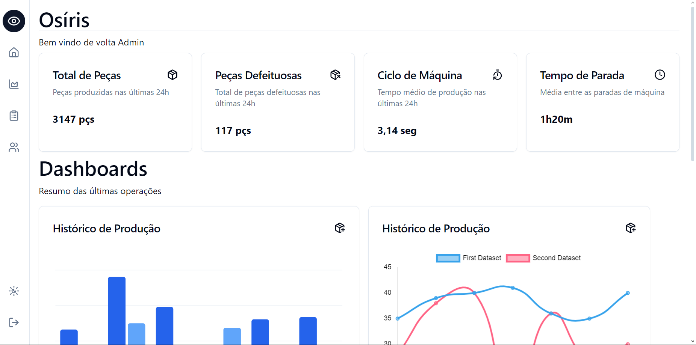

# Projeto Osíris
>Plataforma de Monitoramento IoT

## **Contexto:**

Imagine uma fábrica de produção de peças para automóveis. O processo de produção envolve diversas etapas, desde o recebimento da matéria-prima até a embalagem do produto. Para garantir a qualidade e a eficiência da produção, a fábrica precisa monitorar em tempo real dados como: quantidade de peças, taxa de defeitos, ciclo de máquina e ciclo de energia.

## Objetivo
O objetivo do projeto é criar uma plataforma de monitoramento IoT que seja prática, moderna e de fácil visualização tanto dos dados quanto dos usúarios.

Permitindo a coleta e análise de sensores para exibição em dashboards com gráficos e tabelas em tempo real, além da possibilidade criar relatórios personalizados como produção diária, performance por etapa e consumo energético.

Link do wireframe(Rascunho das Telas):
[Figma](https://www.figma.com/design/LSUJj8BEQqXBSAxqPDd5dz/Projeto-ERP?node-id=0-1&node-type=CANVAS&t=zlKnjMNjIq8ROp7T-0)

### _User Flow_

Primeiramente o usúario deve cadastrar suas credenciais ou validar se já forem existentes na tela de *Login*:

Após isso será redirecionado para a tela principal, contendo informações gerais, trazendo **praticidade** e **versatilidade** já que engloba *dashboards*, relatórios e produção até o momento.

